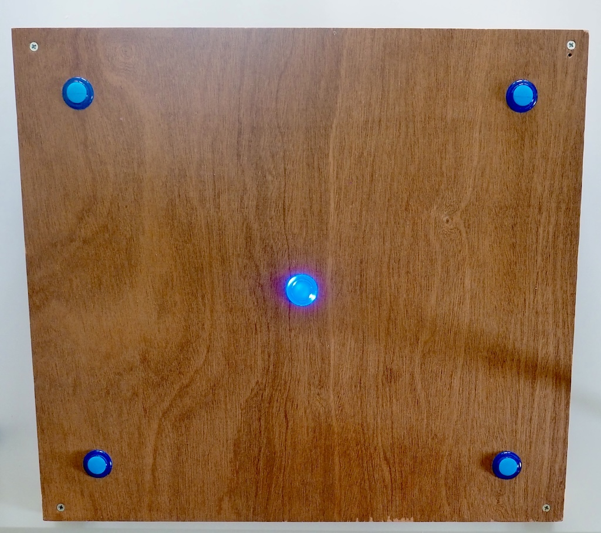

# Swatak

This reaction time game is inspired by the [BATAK© boards](https://www.batak.com/) used, among others, by [F1 drivers](https://www.youtube.com/watch?v=-p-f0zosPV4) to test and train hand-eye coordination and reaction speed.  

This mini version uses 5 buttons (with included LEDs) arranged in a cross pattern.



## Hardware

The microcontroller used in this project is a [Seeed Studio XIAO nRF52840](https://wiki.seeedstudio.com/XIAO_BLE/).  
I used these [buttons](https://www.kiwi-electronics.com/en/24mm-arcade-button-with-led-translucent-blue-9972?search=button%20with%20led) when building the project, but all you need is a dry-contact push button and some way to associate a light with it.  

The LEDs are connected to PINs D0, D2, D4, D8 and D10 (and to ground).  
The buttons are connected to PINs D1, D3, D5, D7 and D9 (and to the 3V3 pin).  

## Game logic

When the board is first powered up, the game is in a waiting state. The LEDs will blink in a pattern: top left, center, bottom left, bottom right, and top right.  
Tapping any button will start the game. The top left, center and bottom right LEDs will light up, then go off one by one, counting down to the game start.  
When game starts, a random LED lights up. The user has to tap the corresponding button as quickly as possible. Once the user taps the correct button, a new random position will light up.  
The game lasts for 30 seconds, after which an end animation displays, alternating a \ and a / pattern with the LEDs.  

Statistics about your game are printed to the serial console. These include:
- Total number of taps
- Number of correct taps
- Fastest, slowest and average reaction times  
After 10 seconds, the game returns to the waiting state animation, and a new game can be started.

Check out [this video](https://youtu.be/xE6_7VOueBI) to see the game in action.

## Software

The implementation is done in Embedded Swift, using the nRF Connect SDK.  
It has been tested using Swift Development Snapshot from December 10, 2024, nRF Connect SDK 2.7.0 and cmake 3.30.5.  

The file `boards/xiao_ble.overlay` is used to define the devicetree configuration for the 10 GPIO pins used to connect the LEDs and the buttons.  

During the build, warnings are emitted about unused constants. Those constants are required for proper manual memory management and I've not found a way to silence the warnings while maintaining correct code behavior.  

### Building from the command line

Ensure that you have properly installed the nRF Connect SDK and can build and run one of the simple examples, such as "blinky".  
Also make sure you have a recent nightly Swift toolchain installed.  

Specify the nightly toolchain to be used via the `TOOLCHAINS` environment variable, e.g.:
```
export TOOLCHAINS='org.swift.62202412101a'
```
Create the Ninja build file, specifying the target board and the extra overlay to use  :
```
cmake -B build -G Ninja -DBOARD=xiao_ble/nrf52840 -DDTC_OVERLAY_FILE=./boards/xiao_ble.overlay -DUSE_CCACHE=0 .
```

Build the project:
```
cmake --build build
```

Put the XIAO board in bootloader mode by double-clicking the reset button. This should mount the device at /Volumes/XIAO-SENSE (on a Mac).  

You can then copy the firmware file to it
```
cp build/zephyr/zephyr.uf2 /Volumes/XIAO-SENSE
```

Note: build from a terminal has been tested without issue with nRF Connect SDK 2.8.0 and cmake 3.31.2  

### Using nRF Connect SDK extension for VS Code

Select the "nRF Connect" View from the Activity bar in VS Code.  
Click on "Add build configuration". In the dialog that appears:
- select the SDK and toolchain versions to use
- select the "Board target" (xiao_ble/nrf52840 or xiao_ble/nrf52840/sense depending on the version you have)
- in "Extra Deviceree overlays", click "Add Overlay" and select the `boards/xiao_ble.overlay` file
- click on "Build Configuration"

For more information on configuring VS Code to work with Embedded Swift and the nRF Connect SDK, see [nrfx-blink Step by Step - Bokeh](https://www.ericbariaux.com/posts/nrfx-blink-step-by-step/).  

Put the XIAO board in bootloader mode by double-clicking the reset button. This should mount the device at /Volumes/XIAO-SENSE (on a Mac).  

You can then copy the firmware file to it
```
cp build/zephyr/zephyr.uf2 /Volumes/XIAO-SENSE
```

Note: WHen using the nRF Connect SDK extension from VS Code, I encountered issues building witg nRF Connect SDK 2.8.0 or cmake 3.31.x  
I have not investigated those further at this stage.  

### Connecting to the console

By default the XIAO nRF52840 will provide console output via the USB port.  
When plugged in (and not in bootloader mode), the board should make a serial port device available on your host.  
On my Mac, this appears as `/dev/cu.usbmodem2101`.  

You can connect to it using any serial port tool or from the terminal using screen:  
```
screen /dev/cu.usbmodem2101
```

## Coming soon

- A complete blog post about the creation of this project.  
- A new version supporting Bluetooth connectivity, enabling a dashboard and control from a mobile device.
